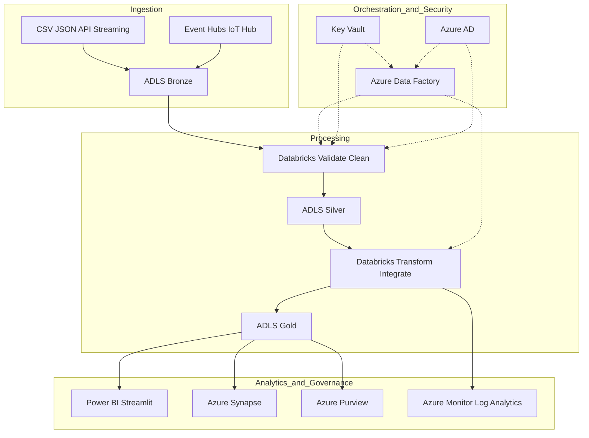
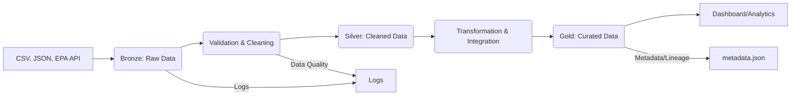

# Azure-Style Environmental Data Platform

This project simulates an enterprise environmental/toxicology data platform using Azure Data Lake, Databricks, and medallion architecture concepts.

## Architecture Overview

- **Bronze Layer:** Raw data ingestion (CSV, JSON, API)
- **Silver Layer:** Cleaned and validated data
- **Gold Layer:** Curated, analytics-ready datasets

Data flows through these layers, with validation, logging, and metadata tracking at each stage. The structure simulates Azure Data Lake folders and Databricks jobs using local Python scripts.

## Pipeline Stages

1. **Ingestion:** Load data from files and mock API
2. **Validation:** Schema, range, and quality checks
3. **Transformation:** Standardize, clean, and integrate data
4. **Curation:** Produce analytics-ready datasets with metadata

## Cloud Simulation
- Azure Data Lake: Local folders (`data/bronze`, `data/silver`, `data/gold`)
- Databricks: Python pipeline scripts
- Key Vault: `config/key_vault.json`
- RBAC: `config/rbac.json`


## Dashboard

Run the Streamlit dashboard to visualize environmental trends and data quality:

```bash
pip install -r requirements.txt
streamlit run scripts/dashboard.py
```


## Data Quality Log & Data Provenance

The pipeline automatically logs data validation, quality checks, and provenance information to `logs/data_quality.log` at each stage. This log helps track:

- Schema validation results
- Range and value checks
- Duplicate detection
- Errors and warnings during ETL
- Data source and transformation lineage

**Data provenance** is maintained by recording the origin, validation status, and transformation history of each dataset. This ensures traceability and auditability for all data processed through the platform.

- See `logs/data_quality.log` for quality and provenance logs
- See `metadata.json` for dataset lineage and versioning

---

## Getting Started
- Run `pipeline.py` to execute the full ETL pipeline
- See `logs/` for data quality and error logs
- See `metadata.json` for lineage and versioning


## Cloud Architecture Diagram (Azure + Databricks)




## Cloud Setup Commands (Azure CLI)

### 1. Create a Resource Group
```bash
az group create --name myResourceGroup --location eastus
```

### 2. Provision Azure Data Lake Storage (ADLS Gen2)
```bash
az storage account create --name mystorageacct --resource-group myResourceGroup --location eastus --sku Standard_LRS --kind StorageV2 --hierarchical-namespace true
az storage container create --account-name mystorageacct --name bronze
az storage container create --account-name mystorageacct --name silver
az storage container create --account-name mystorageacct --name gold
```

### 3. Create Azure SQL Database
```bash
az sql server create --name my-sql-server --resource-group myResourceGroup --location eastus --admin-user myadmin --admin-password MyPassword123!
az sql db create --resource-group myResourceGroup --server my-sql-server --name emdatawarehouse --service-objective S0
```

### 4. Deploy Azure Databricks Workspace
```bash
az databricks workspace create --resource-group myResourceGroup --name myDatabricksWS --location eastus --sku standard
```

### 5. Set Up Azure Key Vault
```bash
az keyvault create --name myKeyVault --resource-group myResourceGroup --location eastus
az keyvault secret set --vault-name myKeyVault --name "DbPassword" --value "MyPassword123!"
```

### 6. Create Azure Data Factory
```bash
az datafactory create --resource-group myResourceGroup --factory-name myDataFactory --location eastus
```

### 7. (Optional) Set Up Azure Synapse Analytics
```bash
az synapse workspace create --name mySynapseWS --resource-group myResourceGroup --storage-account mystorageacct --file-system gold --location eastus --sql-admin-login-user myadmin --sql-admin-login-password MyPassword123!
```

### 8. (Optional) Set Up Azure Purview
```bash
az purview account create --name myPurviewAcct --resource-group myResourceGroup --location eastus
```

### 9. (Optional) Set Up Azure Active Directory for RBAC
- Managed via Azure Portal or with `az ad` commands.

**Note:** Replace resource names, locations, and passwords as needed. You must have the Azure CLI installed and be logged in (`az login`).
# Azure-Style Environmental Data Platform

## ETL Pipeline Diagram (Mermaid)




---

For more details, see inline documentation and comments in each script.
