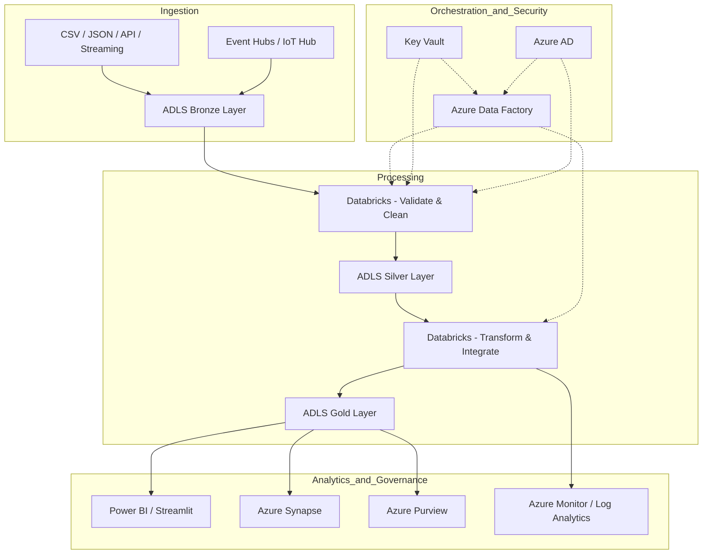
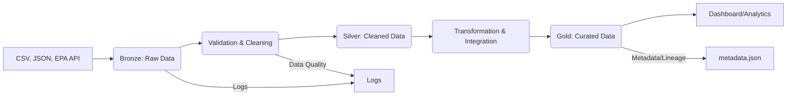

# Azure-Style Environmental Data Platform

This project simulates an enterprise environmental/toxicology data platform using Azure Data Lake, Databricks, and medallion architecture concepts.

## Architecture Overview

- **Bronze Layer:** Raw data ingestion (CSV, JSON, API)
- **Silver Layer:** Cleaned and validated data
- **Gold Layer:** Curated, analytics-ready datasets

Data flows through these layers, with validation, logging, and metadata tracking at each stage. The structure simulates Azure Data Lake folders and Databricks jobs using local Python scripts.

## Pipeline Stages

1. **Ingestion:** Load data from files and mock API
2. **Validation:** Schema, range, and quality checks
3. **Transformation:** Standardize, clean, and integrate data
4. **Curation:** Produce analytics-ready datasets with metadata

## Cloud Simulation
- Azure Data Lake: Local folders (`data/bronze`, `data/silver`, `data/gold`)
- Databricks: Python pipeline scripts
- Key Vault: `config/key_vault.json`
- RBAC: `config/rbac.json`


## Dashboard

Run the Streamlit dashboard to visualize environmental trends and data quality:

```bash
pip install -r requirements.txt
streamlit run scripts/dashboard.py
```


## Data Quality Log & Data Provenance

The pipeline automatically logs data validation, quality checks, and provenance information to `logs/data_quality.log` at each stage. This log helps track:

- Schema validation results
- Range and value checks
- Duplicate detection
- Errors and warnings during ETL
- Data source and transformation lineage

**Data provenance** is maintained by recording the origin, validation status, and transformation history of each dataset. This ensures traceability and auditability for all data processed through the platform.

- See `logs/data_quality.log` for quality and provenance logs
- See `metadata.json` for dataset lineage and versioning

---

## Getting Started
- Run `pipeline.py` to execute the full ETL pipeline
- See `logs/` for data quality and error logs
- See `metadata.json` for lineage and versioning


## Cloud Architecture Diagram (Azure + Databricks)




## ETL Pipeline Diagram (Mermaid)




---

For more details, see inline documentation and comments in each script.
